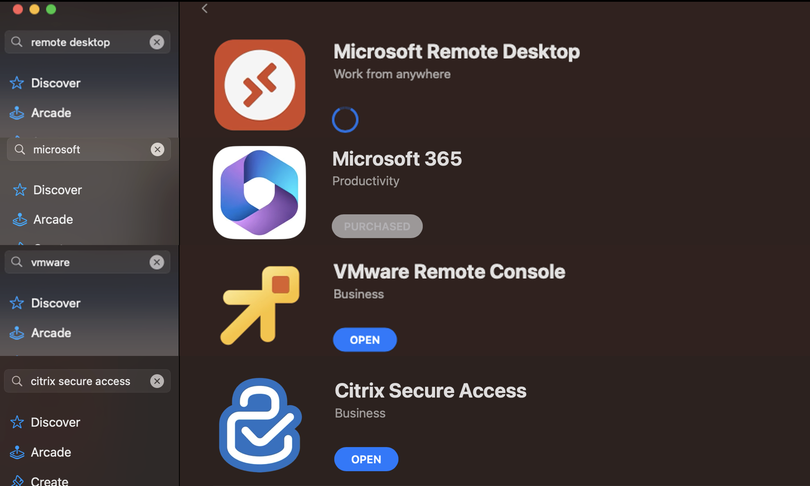
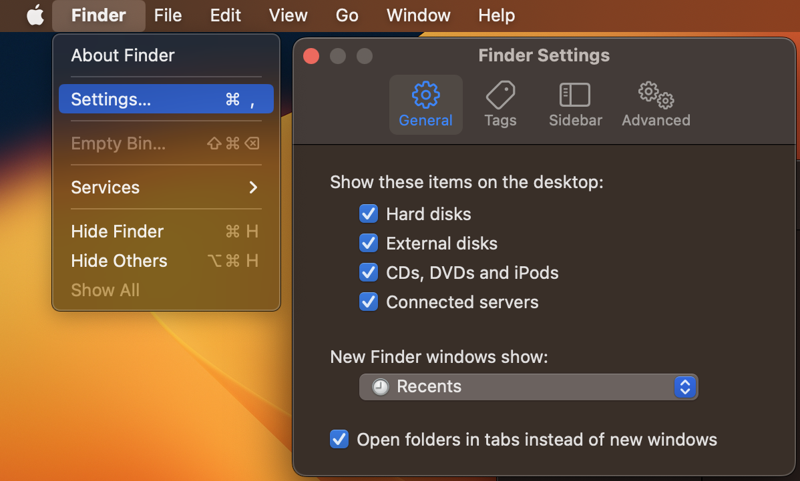
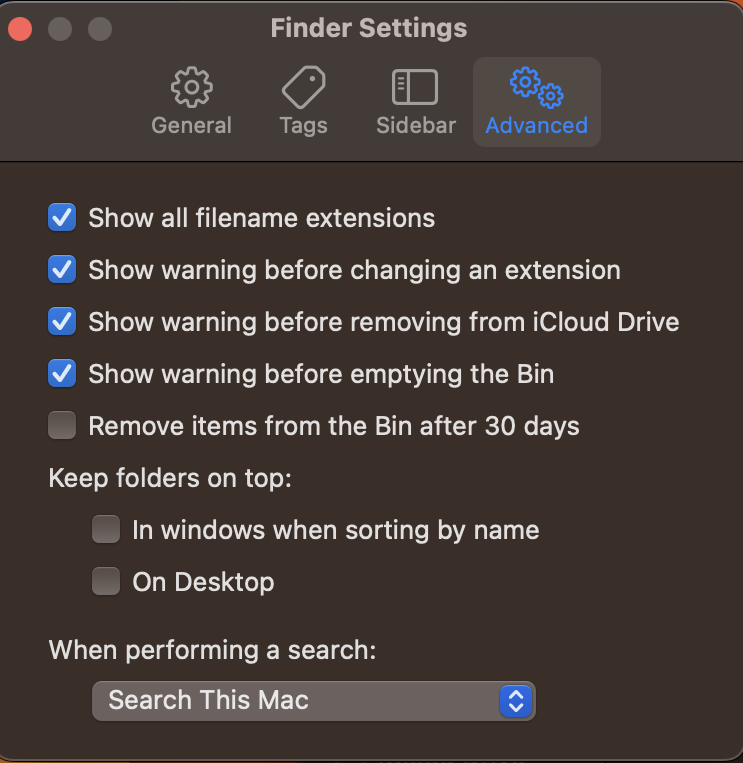
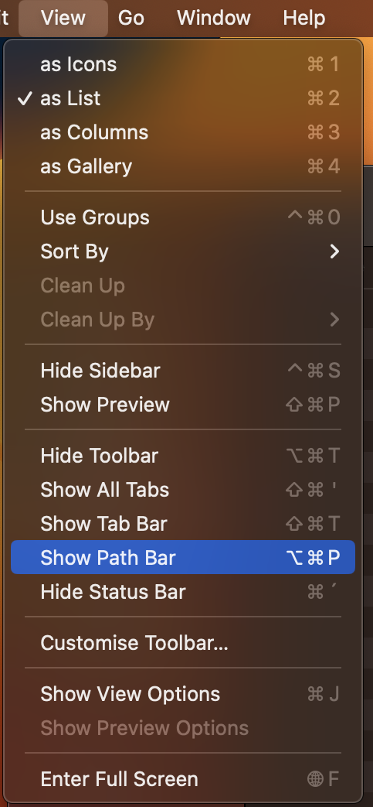
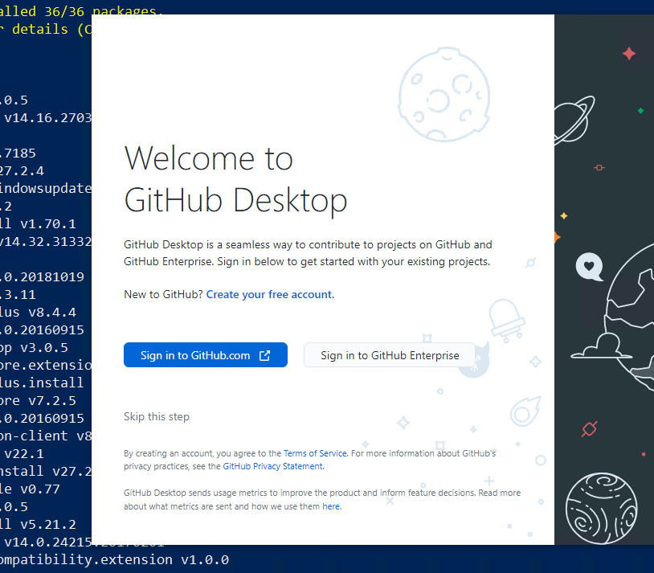
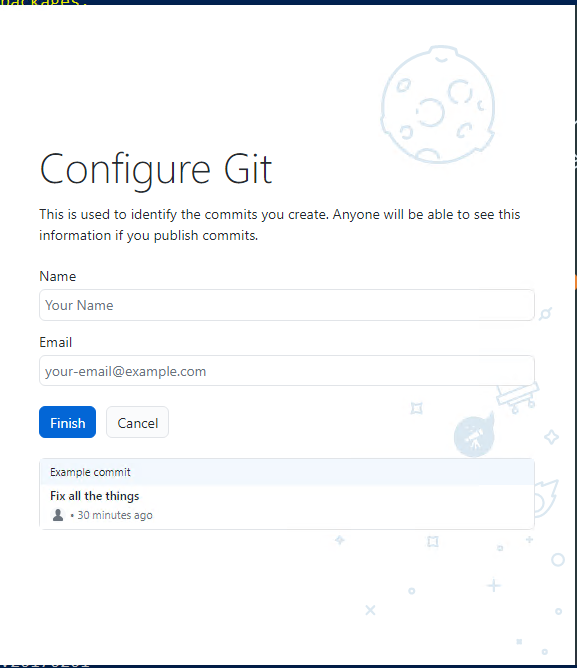

# Installation of basic programs (HAMK BYOD) in students' personal devices (Mac Users)
The following guidelines utilize the **[brew](https://brew.sh/) package manager** for **macOS** to install several applications that are used in different modules in HAMK. 


## Step 1: Installing Apple development environment Xcode and Brew

### Requirements
* A 64-bit Intel CPU or Apple Silicon CPU 1
* macOS Catalina (10.15) (or higher) 2
* Command Line Tools (CLT) for Xcode (from xcode-select --install or https://developer.apple.com/download/all/) or Xcode 3
* Terminal emulator

Open a Terminal by clicking the [Spotlight](https://support.apple.com/guide/mac-help/search-with-spotlight-mchlp1008/mac) (magnifying glass) icon in the menu bar or press **Command-Space bar** and type: "Terminal"

Install the required development environment components

```bash
xcode-select --install
```
Install Brew package manager

```bash
/bin/bash -c "$(curl -fsSL https://raw.githubusercontent.com/Homebrew/install/master/install.sh)"
```

Under "==> Next steps:" Read and copy tree lines of code to terminal and execute it. Here are the examples

```bash
echo '# Set PATH, MANPATH, etc., for Homebrew.' >> /Users/$USER/.zprofile
echo 'eval "$(/opt/homebrew/bin/brew shellenv)"' >> /Users/$USER/.zprofile
eval "$(/opt/homebrew/bin/brew shellenv)"
```

## Step 2: Programs/Apps Installation using Brew
### The list of applications that you are going to install <br>
Vscode, vmware-horizon-client, disk-inventory, Git, Github, obs, Vmware-fusion, Google Drive, Google Chrome, UTM virtualization software, Teams, Cyberduck, Docker,  Zoom and Displaylink USB dock drivers.

### To install the above-mentioned programs run the following script
```bash
brew install --cask visual-studio-code; brew install --cask vmware-horizon-client; brew install --cask disk-inventory-x; brew install --cask zoom; brew install git; brew install --cask github; brew install --cask obs; brew install --cask utm; brew install --cask google-drive; brew install --cask docker; brew install --cask google-chrome; brew install --cask microsoft-teams; brew install --cask cyberduck; brew install --cask displaylink
```

## Step 3: Apple store <br>
We are still missing few basic software for BIT studies and basic use. 
We still need to install *Vmware Horizon client, Microsoft Office* and *Vmware console*. 
Alternative software to Vmware Horizon client (VDI) is *Citrix Secure Access* a HAMK VPN service. 
You **can not** run this software at the same time.




## Step 4: Installing some useful VScode addons 

Open a terminal and run the following command to install VScode Addons/Extensions

```bash
code --install-extension ms-vscode.powershell
code --install-extension vsls-contrib.gistfs
code --install-extension ms-vscode-remote.remote-containers
code --install-extension ms-azuretools.vscode-docker
code --install-extension ms-vscode-remote.vscode-remote-extensionpack
code --install-extension GitHub.copilot
code --install-extension GitHub.copilot
```

## Apple UI changes

We recommend a few changes to the mac operating system that will help you with file management and programming. These are Show items on desktop, File Extensions and Path bar.

### Step 1: Enable show items on desktop and show file extension



### Step 2: Show file path


### Step 3: Get hidden files visible (Like .ssh folder)
Go to Parent folder
press Cmd + Shift + . to reveal the hidden folder and files.
When you no longer want to see them click Command + Shift + . again.


## Step 5: Git and Github
As you progress through your upcoming courses and projects, you'll begin using version control. GitHub, a platform for version control is mainly used at HAMK. You'll start by setting up your own GitHub account. If you already have one,  you don't need to make a new account. While you'll study further into version control concepts in the future, your initial step involves creating an account and getting Git up and running on your personal device.

***Create GitHub Account***

If you already have a **GitHub account**, you can sign in and if you don't have one, you can create a new GitHub account by following the instructions below:  

  1. Go to [GitHub Sign up Page] (https://github.com/signup)
  2. Fill in the Sign Up form. 
  3. Verify your Email address. GitHub will send a verification email to the email address you provided. Go to your email inbox, find the email from GitHub, and click the verification link.
???+ note "Congratulations!"
    Once your email is verified, your account is ready. You can now start using GitHub to create repositories, contribute to projects and collaborate with others.
  
### Link your HAMK email

  Linking your school email to your GitHub account can offer several benefits, especially if you plan to use GitHub for both personal and academic purposes. When you link your your school email with your GitHub account: 
  - It helps to verify your identity which is important when collaborating on academic projects during the module. 
  - You might have access to educational resources for students or discounts. 
  
  ***Mandatory for all*** <br>
!!! Warning
    Mandatory for all
  You are required to link your school email to your personal GitHub account. Please follow the instructions below: 

1. Login to GitHub using your personal account. 
2. Once logged in, go to your [GitHub account settings](https://github.com/settings/emails).
3. In the left sidebar of the Settings page, click on "Emails."
4. In the "Primary email address" section, you should see your personal email address associated with your account. Below that, you can click on the "Add email address" button to add your school email address.
5. GitHub will send a verification email to your school email address. Check your school inbox, open the email, and click on the verification link provided.
  
  Now, you'll have both your personal email and school email associated with your GitHub account. You can choose which email to use when making commits or changes. 

## Step 6: Activate GitHub Student Developer Pack

The GitHub Student Pack is a service meant to help students with their coding and development projects. It offers a variety of significant advantages including free access to premium developer tools, learning materials such as online courses and tutorials, cloud credits for experimentation, and opportunities to obtain hands-on experience with industry-standard technologies. Students can also get domain names for their projects, join a friendly community, and participate in hackathons and coding contests. 

**To activate the GitHub Student Developer Pack, follow these steps:**

1. Access the Student Developer Pack:
 Once Signed in to GitHub and linking up your school's email account, access the   [Sign Up for Student Development Pack](https://education.github.com/benefits?type=student)page.
2. Select your academic status as Student. 
3. Fill in the form and Click Continue. 

???+ Note
    Verification may be required based on the situation. In such cases, you can utilize your mobile student card to complete the verification process.

## Step 7: Configure Git

You have installed Git in Step 2. You need to configure Git by providing your full name and email address.You can start GitHub Desktop and configure using the graphical user interface as shown in the diagram below or use the command line. 




***Configure Git with command line***

1. Open Git Bash. 
2. Set your username and email, which will be associated with your commits. Use these commands, replacing "Your Name" and "your.email@example.com" with your actual information:

```bash
git config --global user.name "Your Name"
git config --global user.email your.email@example.com
```
***Check your Git Configuration***

```bash
git config --list
```
***Congratulations, you have installed most of the required applications that you need while studying at HAMK. Over time, you will need to install additional applications.***

**All completed!**


## Step 9: Virtual machines platforms


You have two good options for virtual machines platforms: Vmware Fusion and Parallels. Vmware Fusion is free for personal use and Parallels is paid. You can choose the one that suits you best. 
???+ Note
    For now Apple computers are not supporting nested virtualization so Docker and Kubernetes need to be installed to the host machine.


***Parallels***

We recommend owners of Mac computers to use Parallels software, which enables Windows programs to run. Parallels and other software used in teaching are heavy, so we also recommend that Apple computers have at least 16 GB of memory and an M2 series processor. The recommendation applies to level 2-3 in the computer recommendation for educational programs. You can download the Parallels software from [https://www.parallels.com/landingpage/pd/education/](https://www.parallels.com/landingpage/pd/education/). You can get the student discount by HAMK email. The order process goes as follows “Buy now -> Can't find your institution? -> enter my.email@student.hamk.fi

***Vmware Fusion***

Vmware Fusion is free for personal use, but needs more configuration than Parallels. So we recommend Parallels for new Mac users. If you are familiar with virtual machines, you can use Vmware Fusion. For smooth working we recommend least 16 GB of memory and an M2 series processor. You can download the Vmware Fusion software from [https://www.vmware.com/go/get-fusionplayer-key](https://www.vmware.com/go/get-fusionplayer-key)

***HAMK Vcommander***

Third option is to use HAMK Vcommander service, but compared to Parallels and Vmware Fusion, it is not as good. You can find more information about Vcommander from [https://www.hamk.fi/it-service-catalog/virtual-it-lab-embotics-vcommander/?lang=en](https://www.hamk.fi/it-service-catalog/virtual-it-lab-embotics-vcommander/?lang=en)


## Here are some recommended apps for faster multitasking.

**Mac Windows manager / Windows snaping tool**  

- [https://rectangleapp.com/](https://rectangleapp.com/)

**Per-device scrolling preferences on macOS.**  

- [https://github.com/pilotmoon/Scroll-Reverser](https://github.com/pilotmoon/Scroll-Reverser)

**Warp terminal**  

- [Warp terminal](https://www.warp.dev/) and [New *incredible* macOS terminal! (warp + starship + zsh)](https://www.youtube.com/watch?v=NfggT5enF4o)
