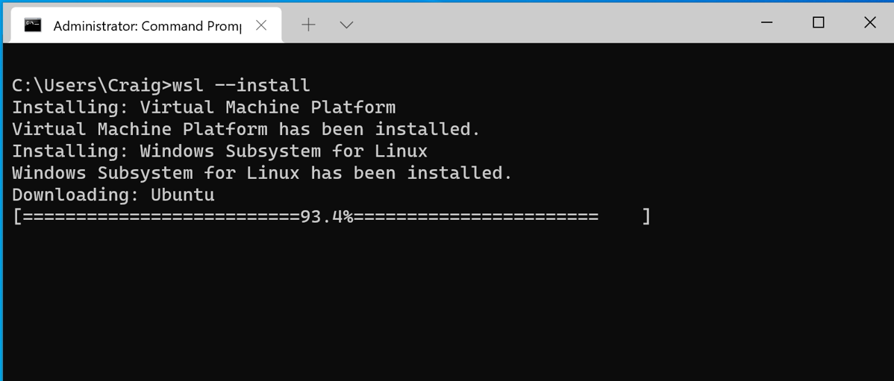
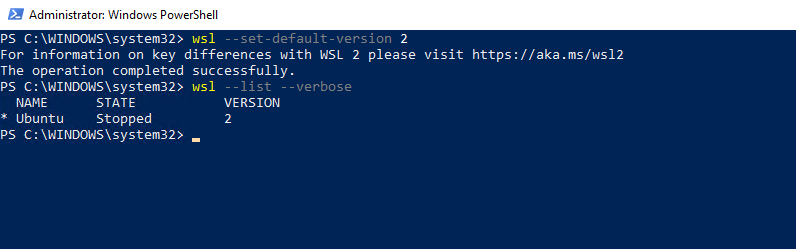

# How to install WSL2 to your computer  (Windows 11) ?

## Installation Process (with PowerShell)
* Start Powershell with Administrator rights (Run as Administrator)

* WSL will be installed to your computer and in the default setting it will download latest Ubuntu
> If you already have wsl installed you should make sure that it is updated. 
Use command `wsl --update` to update it.

```bash
wsl --install
```



## Set default WSL version and check installed distributions

```bash
wsl --set-default-version 2
wsl --list --verbose 
wsl -l -v 
```



##  See a list of the Linux distributions available through the online store.
```bash
wsl --list --online
```


## Lets install Ubuntu 24.04 and Debian Distribution. We will use Ubuntu 24.04 as main platform and Debian for testing. For this reason we will start by removing default Ubuntu from your pc

```bash
wsl --unregister Ubuntu
```
```bash
# Run the command below to install Ubuntu 24.04. Recommended.
wsl --install --web-download --distribution Ubuntu-24.04 

# Run the command below. If you get the error message when trying to install with the above command. 
wsl --install -d Ubuntu-24.04 
```
```bash
# Run the command below to install Debian. Recommended.
wsl --install --web-download --distribution Debian

# Run the command below. If you get the error message when trying to install with the above command. 
wsl --install -d Debian
```
```bash
wsl --setdefault Ubuntu-24.04
```

#  Updating WSL distribution using Powershell

```bash
wsl -d Ubuntu-24.04 -u root bash -c 'apt update ; apt upgrade -y'
wsl -d Debian -u root bash -c 'apt update ; apt upgrade -y'
```


## Enabling systemd to your default WSL distribution Ubuntu-24.04
We are starting to use systemd, which brings WSL Linux closer to a virtual machine or physical installation

```bash
wsl -u root -d Ubuntu-24.04 bash -c "touch /etc/wsl.conf"
wsl -u root -d Ubuntu-24.04 bash -c "echo [boot] >> /etc/wsl.conf" 
wsl -u root -d Ubuntu-24.04 bash -c "echo systemd=true >> /etc/wsl.conf" 
wsl -t Ubuntu-24.04
```
## Upgrading WSL 1 to WSL 2 (only if yours WSL version is 1)

If you run `wsl -l -v` and it shows your **WSL version as 1**, follow the steps below:

> **Note**: If you manually installed WSL before the `wsl --install` command was available, you need to manually install the Linux kernel package. You can find the detailed guide at the link below:
> [Detailed Installation Guide](https://learn.microsoft.com/en-us/windows/wsl/install)

## Steps to Upgrade

1. Install the Linux kernel package as per the detailed guide above.
2. Open PowerShell as Administrator and run the following commands:

    ```bash
    wsl --set-version Ubuntu-24.04 2
    wsl --set-version Debian 2
    ```

3. Re-check your WSL version with the command below to ensure it has been upgraded to version 2:

    ```bash
    wsl -l -v
    ```
## Limiting amount of memory and cpu WSL can use. Change values as needed
Start Powershell with **NORMAL** user rights and copy all command in to it. 

```bash
$contentToAdd = @"
[wsl2]
memory=4GB # Limits VM memory in WSL 2 to 4 GB
processors=2 # Makes the WSL 2 VM use two virtual processors
[experimental]
autoMemoryReclaim=gradual
"@

New-Item $home\.wslconfig
Add-Content $home\.wslconfig $contentToAdd
notepad++ $home\.wslconfig 
```

Last command did open Notepad++ and it is showing curant configuration $home\.wslconfig . If there is need to change default values now is good opportunity to change them base on your computer resources. Starting with WSL version 2.4.11, you can also make changes to the settings using the graphical tool `WSL Settings`. This tool is automatically installed when you install WSL.


# How to backup WSL and remove it from the machine to save space

## Export and import a Ubuntu distribution to a TAR file

```bash
wsl --export Ubuntu-24.04 "G:\My Drive\Ubuntu_wsl_backup_24.04.tar"
```

Import a new distribution

```bash
wsl --import Ubuntu-24.04-Base "c:\temp\" "G:\My Drive\Ubuntu_wsl_backup_24.04.tar"

```


## Uninstalling command is --unregister (Use only if needed)
No need to remove WSL distribution if everything is working

```bash
wsl --unregister Ubuntu-24.04
wsl --unregister Debian
```

# Problem Solving
Update Windows computer and WSL. Start Powershell with Administrator rights as many times is needed. Go through repairs in order and test regularly.

```bash
# Install Windows update modules
Install-Module PSWindowsUpdate -Confirm
Set-ExecutionPolicy -Scope Process -ExecutionPolicy unrestricted
Import-Module PSWindowsUpdate
Get-WindowsUpdate
Install-WindowsUpdate
# Reboot as needed 
Enable-WindowsOptionalFeature -Online -FeatureName Microsoft-Hyper-V -All
```

[Hyper-V still not working? Jump to "Hyper-V still not working?"](#hyper-v-still-not-working) otherwise, move on with WSL install


## Let's check that WSL is installed
```bash
wsl --install
```

## Update WSL kernel

```bash
wsl --update
```

## Reinstall Ubuntu, Debian and Docker images. THIS WILL RESULT IN LOST DATA if you have not save data on your host machine!
???+ danger "Danger: data lost!"
    THIS WILL RESULT IN DATA LOST if you have not saved data on your host machine!
    ```bash
    Stop-Process -Name "Docker Desktop" -Force
    wsl --unregister Ubuntu-24.04
    wsl --unregister Ubuntu
    wsl --unregister Debian
    wsl --unregister docker-desktop-data
    wsl --unregister docker-desktop
    wsl --set-default-version 2
    wsl --install --web-download --distribution Ubuntu-24.04
    ```
Now we need to update WSL Ubuntu-24.04 to update
```bash
wsl -d Ubuntu-24.04 -u root bash -c 'apt update ; apt upgrade -y'
wsl --setdefault Ubuntu-24.04
```
# Hyper-V still not working?

Forcing Hyper-v to start using Windows bootloader. 

* Start Powershell with Adminitrator rights (Run as Administrator)

```
bcdedit /set hypervisorlaunchtype auto
```

More command can be found [https://docs.microsoft.com/en-us/windows/wsl/basic-commands](https://docs.microsoft.com/en-us/windows/wsl/basic-commands)
