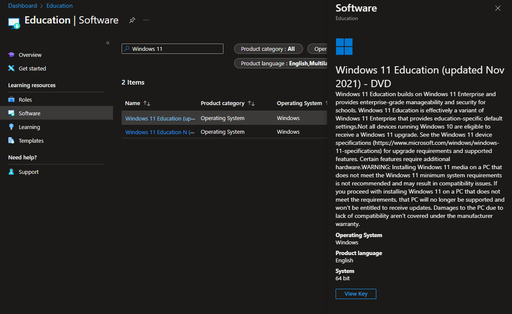
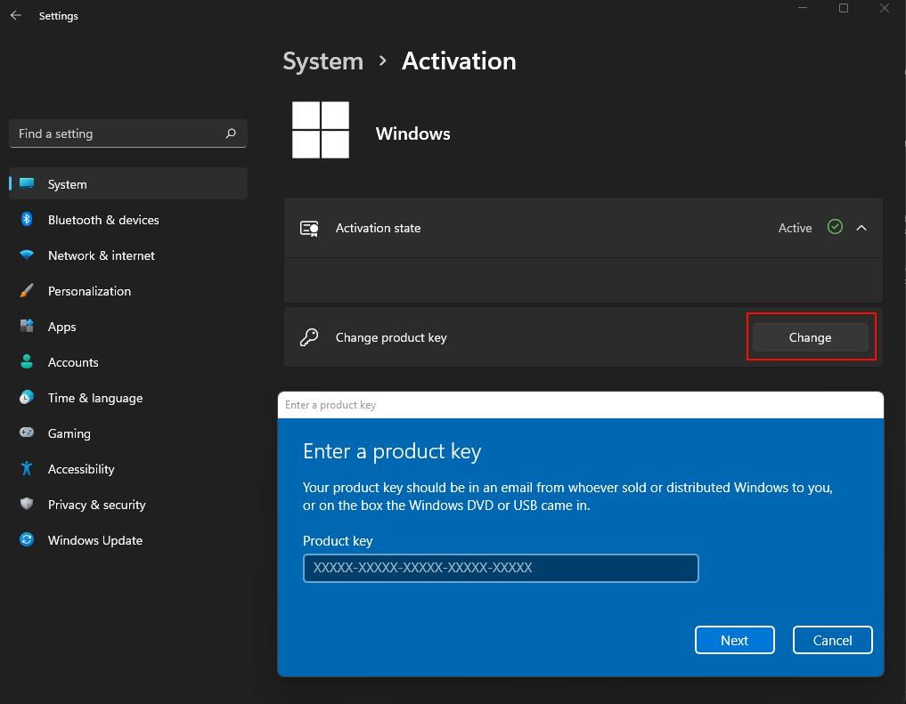
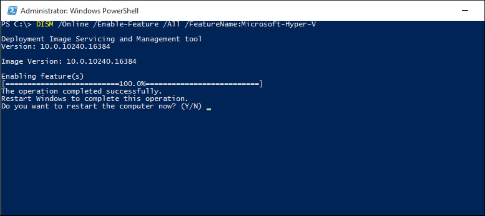
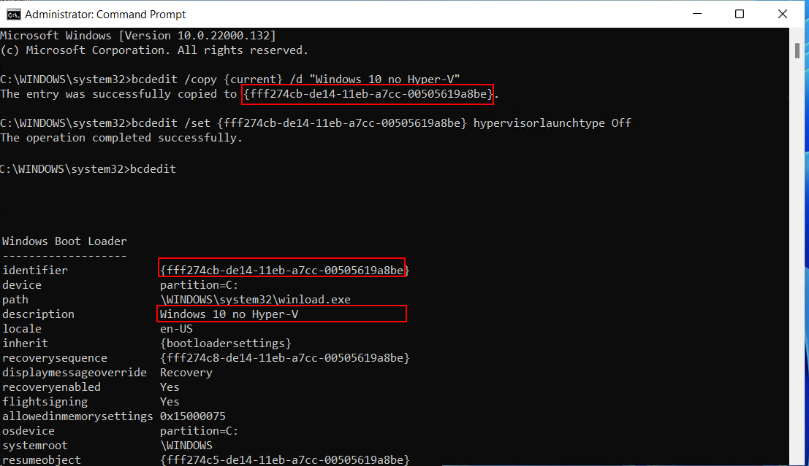

# How to update Windows 11 license from home to education and activate Hyper-V?

## Step 1: Backup Windows license

* Start Powershell or Command Prompt with administrator privileges.
* Run the following command to save the Windows License key as a text file named license.txt
```powershell
(Get-WmiObject -Class SoftwareLicensingService).OA3xOriginalProductKey | Out-File license.txt
```
**Or you may also run the following command, the following command displays the the product key in the Command Prompt or PowerShell window** 

```powershell
wmic path SoftwareLicensingService get OA3xOriginalProductKey
```
???+ info
    * Save it in a safe place 😊

???+ Note
    Microsoft is slowly moving to a digital licenses that are tied to your laptop’s hardware or Microsoft account. In this situation you WILL NOT get a license key because activation will be done without it.` [Read more from here](https://support.microsoft.com/en-us/windows/activate-windows-c39005d4-95ee-b91e-b399-2820fda32227)

## Step 2: Getting a new Windows 11 Education license

1. Log in to [Azure For Education](https://azureforeducation.microsoft.com/devtools).

2. Once logged in, navigate to the "Windows 11" section.



3. In the "Windows 11" section, you will find the product key associated with the Windows 11 Educational version.

4. View the key and make sure to save it to your computer.

## Step 3: Activate your new product key

Please follow these steps to activate a new product key in Windows:

1. **Open Settings:** Click the **Start** button, then click the **Settings**.

2. **Update & Security:** Select **Update & Security** from the Settings window.

3. **Activation:** In the left sidebar, click **Activation**.

4. **Change Product Key:** Under Activation, click **Change product key**.

5. **Enter Key:** Input your new product key.

6. **Activate:** Click **Next** and follow the prompts to activate Windows.

7. **Restart:** If required, restart your computer to apply the changes.



???+ Note
    Sometimes, updating your Windows license might lead to unexpected errors. Don't be surprised – it's just Microsoft's unique way of saying **"Job well done!"** 

## TMP / Enabling Virtualization in BIOS/UEFI
- [How to enable virtualization? ](https://www.isumsoft.com/computer/enable-virtualization-technology-vt-x-in-bios-or-uefi.html) <br>
- [How to access BIOS settings for different manufacturer? ](https://2nwiki.2n.cz/pages/viewpage.action?pageId=75202968)

## How to Activate Hyper-V?

To enable Hyper-V on your Windows machine, follow these steps:

1. **Open Control Panel:** Search "Control Panel" in the search box and click "Control Panel" to open it.

2. **Programs and Features:** Click on "Programs" and then select "Turn Windows features on or off."

3. **Enable Hyper-V:** In the "Windows Features" window, scroll down and find "Hyper-V." Check the box next to "Hyper-V" to enable it.

4. **Optional Features:** You might also want to select additional Hyper-V features like "Hyper-V Management Tools" and "Hyper-V Platform" for a comprehensive experience.

5. **Confirm and Install:** Click "OK" to confirm the changes. Windows will install the necessary components.

6. **Restart:** After the installation is complete, you'll be prompted to restart your computer. Save your work and click "Restart."

> Remember, enabling Hyper-V requires administrative privileges and may impact other virtualization software you might be using. If you encounter issues or need to run software that conflicts with Hyper-V, you can always disable it by following similar steps and unchecking the "Hyper-V" box.

***Activating Hyper-V Using PowerShell***

To activate Hyper-V on your Windows machine using PowerShell, follow these steps:

1. **Open PowerShell:** Start Windows PowerShell with administrative privileges.

2. **Run Command:** In the PowerShell window, enter the following command to enable Hyper-V:
   ```powershell
   Enable-WindowsOptionalFeature -Online -FeatureName Microsoft-Hyper-V -All
   ```



*Restart your computer finalize the changes to your operating system*

***Congratulations, you have updated your Windows 11 license and activated Hyper-v***

# FAQ / Problem solving

## Hyper-V still not working?

Forcing Hyper-v to start using Windows bootloader. 

* Start Powershell with Administrator rights (Run as Administrator)

```powershell
bcdedit /set hypervisorlaunchtype auto
```
 
 ***Need to shut down Hyper-v for compative gaming?***

Let's generate new Windows boot option for NO Hyper-v running. *You need to modify the command to match the bootloader tag*



```powershell
  bcdedit /copy {current} /d "Windows 11 no Hyper-V"
  bcdedit /set {Add your identifier here} hypervisorlaunchtype Off
```