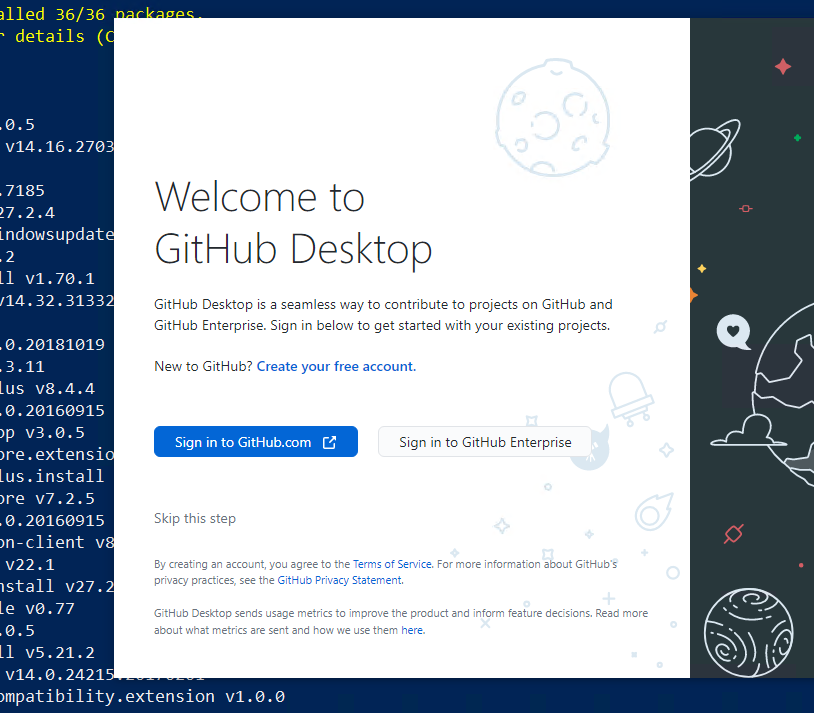
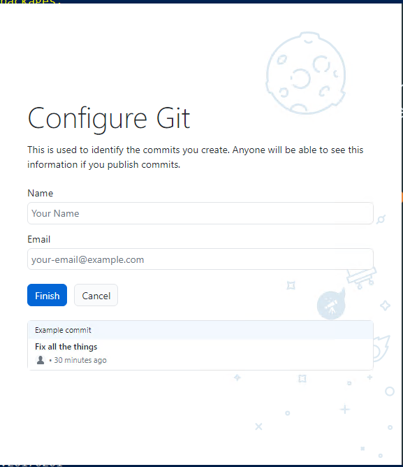

# Installation of basic programs (HAMK BYOD) in students' personal devices (Windows). 

The following guidelines utilizes the [Winget] (https://learn.microsoft.com/en-us/windows/package-manager/winget/) to install several applications that are used in different cources in HAMK. 

???+ note
    Remember, if you switch to a new device, just follow these instructions to ensure you have the necessary tools:


## Step 0

Make sure that your computer meets HAMK BYOD requirements. You can find the requirements from [here](https://www.hamk.fi/en/student-pages/it-services-for-students/it-rules-and-guidelines/)

Main points are:

- Windows 11 (25H2 or newer)

- 16 GB of memory

- If you are using Mac then move to Mac instruction

## Step 1: Updating Windows to the most up-to-date version.

Before installing study software, update your device to Windows 11 version 25H2.

1. Open **Settings** from the Start menu.
2. Go to **Windows Update**.
3. Click **Check for updates**.
4. Install all available updates.
5. If you see **Feature update to Windows 11, version 25H2**, click **Download and install**.
6. Restart your computer.
7. Return to **Settings > Windows Update** and check again until you see that your device is up to date.

To get advanced and optional updates:
1. Open **Settings** from the Start menu.
2. Go to **Windows Update**.
3. Go to **Advanced options**.
4. Select **Receive updates for other Microsoft products**.
5. Select **Optional updates** and install them as needed.
6. Restart your computer.


## Step 2: Programs/Apps Installation using Winget

After getting your base system up to date, we are going to install basic programs that are used in your studies. You can install them one by one, but this is the easiest and fastest way to do it.


***The list of apps that you are going to install is as below:*** <br>

> powershell-core, git, vscode, putty, firefox, greenshot,google-drive-file-stream, googlechrome, safeexambrowser, notepadplusplus, winscp, 7zip,  paint.net, windirstat, zoom, docker-desktop, obs-studio and powertoys

***To install the above-mentioned programs, run the following commands. Winget does not support multi-install, so the command structure is a little bit weird.***

```powershell
winget update
winget install -e --id Microsoft.PowerShell
winget install -e --id Mozilla.Firefox
winget install -e --id Git.Git --custom '/components=""'
winget install -e --id Microsoft.VisualStudioCode
winget install -e --id PuTTY.PuTTY
winget install -e --id Greenshot.Greenshot
winget install -e --id Notepad++.Notepad++
winget install -e --id WinSCP.WinSCP
winget install -e --id 7zip.7zip
winget install -e --id dotPDN.PaintDotNet
winget install -e --id WinDirStat.WinDirStat
winget install -e --id Google.GoogleDrive
winget install -e --id Google.Chrome
winget install -e --id Microsoft.PowerToys
winget install -e --id Microsoft.WindowsTerminal
winget install -e --id Zoom.Zoom
winget install -e --id VideoLAN.VLC
winget install -e --id cURL.cURL
winget install -e --id OBSProject.OBSStudio
winget install -e --id Microsoft.Sysinternals.RDCMan
winget install -e --id Microsoft.Office
winget install -e --id Docker.DockerDesktop
winget install -e --id ETHZurich.SafeExamBrowser
```

??? note "Basic commands for Winget (Click to open)"

    ```powershell
    # Search for an app
    winget search vscode

    # Check for available upgrades
    winget upgrade

    # Upgrade all apps on your computer
    winget upgrade --all

    # Upgrade a specific app
    winget upgrade -e --id VideoLAN.VLC

    # Pin an app version (prevent upgrades)
    winget pin add --id VideoLAN.VLC

    # List pinned apps
    winget pin list

    # Remove a pin
    winget pin remove --id VideoLAN.VLC
    ```


## Step 3: Installing some useful VScode addons 

* Restart your Powershell session by closing the window and opening it again
* Run the following commands 

```powershell linenums="1"
code --install-extension ms-vscode.powershell
code --install-extension vsls-contrib.gistfs
code --install-extension ms-vscode-remote.remote-containers
code --install-extension ms-azuretools.vscode-docker
code --install-extension ms-vscode-remote.vscode-remote-extensionpack
code --install-extension GitHub.vscode-pull-request-github
```
## Step 4: Create GitHub Account

As you progress through your upcoming courses and projects, you'll begin using version control. GitHub, a platform for version control is mainly used at HAMK. You'll start by setting up your own GitHub account. If you already have one,  you don't need to make a new account. While you'll study further into version control concepts in the future, your initial step involves creating an account and getting Git up and running on your personal device.

***Create GitHub Account***

If you already have a **GitHub account**, you can sign in and if you don't have one, you can create a new GitHub account by following the instructions below:  

  1. Go to [GitHub Sign up Page](https://github.com/signup)
  2. Fill in the Sign Up form. 
  3. Verify your Email address. GitHub will send a verification email to the email address you provided. Go to your email inbox, find the email from GitHub, and click the verification link.

  > Congratulations! Once your email is verified, your account is ready. You can now start using GitHub to create repositories, contribute to projects and collaborate with others.
  
### Link your HAMK email

  Linking your school email to your GitHub account can offer several benefits, especially if you plan to use GitHub for both personal and academic purposes. When you link your your school email with your GitHub account: 
  - It helps to verify your identity which is important when collaborating on academic projects during the module. 
  - You might have access to educational resources for students or discounts. 
  

!!! Warning "Mandatory for all"
    We will be using Github Student pack. For that we need to link your Github account to @student.hamk.fi email address.

Please follow the instructions below: 

1. Login to GitHub using your personal account. 
2. Once logged in, go to your [GitHub account settings](https://github.com/settings/emails).
3. In the left sidebar of the Settings page, click on "Emails."
4. In the "Primary email address" section, you should see your personal email address associated with your account. Below that, you can click on the "Add email address" button to add your school email address.
5. GitHub will send a verification email to your school email address. Check your school inbox, open the email, and click on the verification link provided.
  
  Now, you'll have both your personal email and school email associated with your GitHub account. You can choose which email to use when making commits or changes. 

## Step 5: Activate GitHub Student Developer Pack

The GitHub Student Pack is a service meant to help students with their coding and development projects. It offers a variety of significant advantages including free access to premium developer tools, learning materials such as online courses and tutorials, cloud credits for experimentation, and opportunities to obtain hands-on experience with industry-standard technologies. Students can also get domain names for their projects, join a friendly community, and participate in hackathons and coding contests. 

**To activate the GitHub Student Developer Pack, follow these steps:**

1. Access the Student Developer Pack:
 Once Signed in to GitHub and linking up your school's email account, access the   [Sign Up for Student Development Pack](https://education.github.com/benefits?type=student) page.
2. Select your academic status as Student. 
3. Fill in the form and Click Continue. 

  > Note: Verification may be required based on the situation. In such cases, you can utilize your mobile student card to complete the verification process. Now in 2026 Github will require location information on the system that is used to activate. Allow it on your computer or use your cellphone to complete verification

## Step 6: Configure Git

You have installed Git in Step 2. You need to configure Git by providing your full name and email address.You can start GitHub Desktop and configure using the graphical user interface as shown in the diagram below or use the command line. 




***Configure Git with command line***

1. Open a terminal. 
2. Set your username and email, which will be associated with your commits. Use these commands, replacing "Your Name" and "your.email@example.com" with your actual information:

```bash
git config --global user.name "Your Name"
git config --global user.email your.email@example.com
```
***Check your Git Configuration***

```bash
git config --list
```
> You're now set up to use Git on Windows. You can create repositories, make commits, and interact with remote repositories using Git commands. 

***Congratulations on successfully installing the essential applications necessary for your studies at HAMK. As you progress, there might be a need to install additional applications.***
